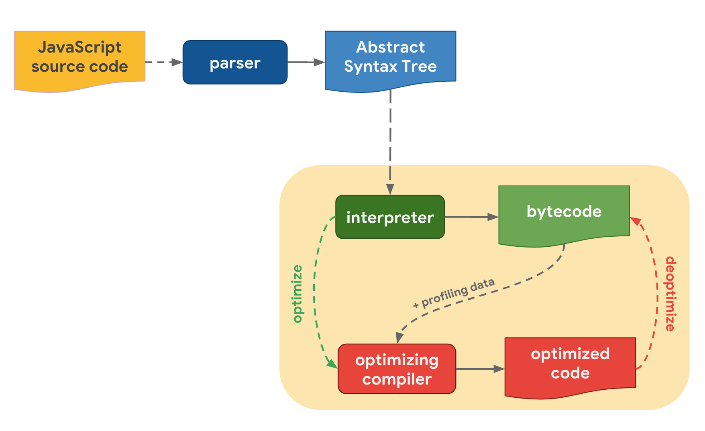

## 들어가기

인간과 컴퓨터는 서로 사용하는 언어가 다릅니다. 따라서, 컴퓨터가 이해할 수 있는 통역사가 필요한다. 여기서 말하는 통역사의 역할을 하는 것이 바로 **컴파일러 혹은 인터프리터**입니다. 우리가 컴퓨터와 소통하기 위해서는 코드를 작성하고 이러한 코드를 기계어로 변환하여 컴퓨터와 소통할 수 있습니다.  

**컴파일러 VS 인터프리터**

- 컴파일러는 소스코드 전체를 한 번 훑고 컴퓨터 프로세서가 실행 할 수 있도록 바로 기계어로 변환한다.
- 인터프리터는 고레벨 언어를 중간 코드(intermediate code)로 변환하고 이를 각 행을 연속적으로 실행한다.
- 일반적으로 컴파일러가 인터프리터보다는 실행시간이 빠르다.
- 컴파일러는 전체 소스코드를 변환 한 뒤 에러를 보고하지만 인터프리터는 각 행 마다 실행하는 도중 에러가 보고되면 이후 작성된 코드를 살펴보지 않는다.
    

## V8 엔진이란?

C++ 로 작성된 구글의 오픈소스 자바스크립트 엔진.

즉, 자바스크립트 코드를 바이트코드 혹은 기계어로 바로 변환해주는 역할을 합니다.

세상에는 V8 엔진뿐만 아니라 다양한 종류의 자바스크립트 엔진이 존재하나, 모두 ECMAScript 표준을 따릅니다.

하지만, V8은 다른 엔진과 달리 모두 기계어로 변환하지 않고 바이트 코드와 기계어로 변환한다.
  

## 작동원리

 

1. V8은 소스코드를 가져다가 파서에게 넘긴다.
2. 소스 코드를 분석후 AST(Abstract Syntax Tree) 즉, 추상 구문 트리로 변환하고 Ignition에게 넘겨준다.
3. Ignition은 자바스크립트를 **바이트 코드**로 컴파일해주는 역할을 수행한다.
4. 이후 이 바이트 코드를 실행함으로써 소스 코드가 실제로 작동한다.
5. 그 중, 자주 사용되는 코드는 TurboFan에 넘겨져 최적화시키기 위해 다시 **기계어**로 컴파일 된다.
     

## V8의 역할

1. JS, WASM 코드 컴파일 및 실행
2. 콜 스택 처리 (함수 실행)
3. 메모리 할당
4. 가비지 컬렉션
     

**참고자료**

[JavaScript 엔진 톺아보기](https://velog.io/@godori/JavaScript-engine-1)
